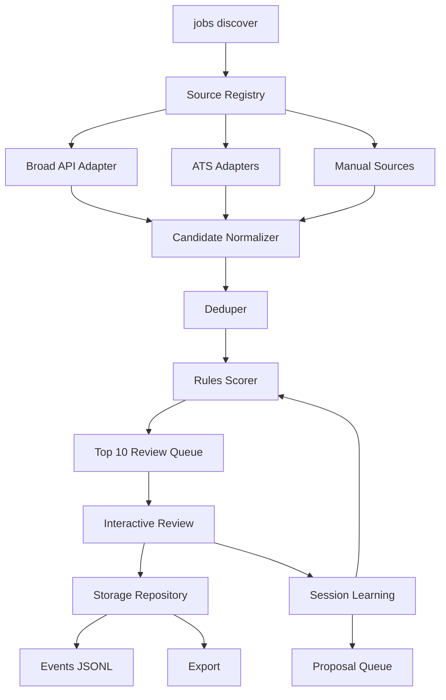

# Technical Spec: AI Builder Jobs CLI

Generated: 2026-05-12
Source: `plans/greenfield/PRODUCT_SPEC.md`

## Summary

Build AI Builder Jobs as a local TypeScript CLI in a small pnpm monorepo. The MVP uses rules-based scoring, local JSON/JSONL storage, one broad jobs API adapter requiring an API key, ATS/company-board adapters, and an interactive review loop. The public board and advanced classifier are out of scope.

The technical design prioritizes:

- Inspectable local data.
- Deterministic scoring and explanations.
- Adapter-based sourcing so coverage can be measured and sources can change.
- No LinkedIn scraping dependency.
- Future reuse by a Next.js public board and patterns from `~/Projects/fast_pr_analytics`.

## Technology Choices

### Runtime And Package Management

Use:

- Node.js `>=22.12`
- TypeScript
- pnpm workspace
- ESM modules

Rationale:

- Node 22+ gives stable built-in `fetch`, modern ESM support, and current LTS compatibility.
- TypeScript keeps schemas, scoring, source adapters, and future Next.js export contracts shareable.
- pnpm matches `fast_pr_analytics` and supports a clean workspace split.

Sources:

- Node.js release lifecycle: https://nodejs.org/en/about/previous-releases
- pnpm workspaces: https://pnpm.io/workspaces

### Libraries

Use:

- `commander` for command routing.
- `@inquirer/prompts` for interactive review prompts.
- `zod` for runtime schema validation and inferred TypeScript types.
- `vitest` for unit and integration tests.
- `tsx` for local TypeScript execution during development.
- `tsup` for building the CLI package.

Rationale:

- Commander is a mature CLI framework with TypeScript support.
- Inquirer prompts are enough for rich review cards plus `yes`/`maybe`/`no` flows without a full-screen TUI.
- Zod provides a single source of truth for local file schemas and adapter payload validation.
- Vitest fits TypeScript package testing and can run unit tests against isolated modules and temp directories.

Sources:

- Commander: https://github.com/tj/commander.js
- Inquirer prompts: https://www.npmjs.com/package/@inquirer/prompts
- Zod: https://zod.dev/
- Vitest: https://vitest.dev/

### Deferred Technologies

Do not include these in MVP:

- OpenAI or other LLM classifier.
- Embeddings.
- SQLite or Postgres.
- Full-screen TUI framework.
- Public Next.js app.
- Background daemon.

Advanced classifier work is tracked separately in `features/job_classifier/INITIAL_NOTES.md`.

## Repository Structure

Use a pnpm monorepo:

```text
apps/
  cli/
    src/
      index.ts
      commands/
      review/
    package.json
packages/
  core/
    src/
      adapters/
      config/
      dedupe/
      events/
      scoring/
      schemas/
      storage/
      sources/
      proposals/
      sessions/
      export/
    package.json
data/
  jobs/
  source-listings/
  sources/
  proposals/
  sessions/
  exports/
  events.jsonl
  config.json
features/
  job_classifier/
plans/
  greenfield/
```

`apps/cli` owns command parsing and terminal UX. `packages/core` owns source adapters, storage, scoring, dedupe, schemas, and export logic. Runtime data is stored under `data/` as inspectable JSON/JSONL files. Secrets are loaded from `.env.local` or process environment and must not be written into `data/`.

## Architecture Overview



Core flow:

1. CLI command invokes a service in `packages/core`.
2. Source registry selects enabled adapters.
3. Adapters return normalized candidate payloads.
4. Deduper maps candidates to canonical jobs and source listings.
5. Rules scorer computes a 0-100 score and explanation.
6. Review session shows up to 10 ranked candidates.
7. User labels are written as events and update canonical job state.
8. Immediate session-only scoring adjustments can re-rank remaining candidates.
9. Larger durable logic changes are written to proposals for approval.

## Data Storage

### Storage Principles

- Use local JSON files for entities and JSONL for append-only events.
- Validate every read/write with Zod schemas.
- Use atomic writes: write to `*.tmp`, then rename.
- Never store API keys.
- Never store full job descriptions by default.
- Store transient description-derived signals, not the full text.
- Store timestamps as ISO 8601 strings.

### Data Paths

```text
data/config.json
data/events.jsonl
data/jobs/{jobId}.json
data/source-listings/{sourceListingId}.json
data/sources/{sourceId}.json
data/proposals/{proposalId}.json
data/sessions/{sessionId}.json
data/do-not-merge/{decisionId}.json
data/scoring-rules.json
data/exports/{timestamp}.json
```

### Core Types

```ts
type ReviewLabel = "yes" | "maybe" | "no";
type LifecycleStatus = "candidate" | "active" | "maybe" | "rejected" | "archived";
type WorkType = "remote" | "hybrid" | "onsite" | "unknown";
type PreferenceMode = "hard_filter" | "soft_rank" | "note_only";
```

### Canonical Job

```ts
type JobRecord = {
  schemaVersion: 1;
  id: string;
  title: string;
  company: string;
  discoveredAt: string;
  updatedAt: string;
  lifecycleStatus: LifecycleStatus;
  currentReviewLabel?: ReviewLabel;
  location?: string;
  workType: WorkType;
  compensation?: {
    min?: number;
    max?: number;
    currency?: string;
    period?: "year" | "month" | "hour" | "unknown";
    raw?: string;
  };
  postedDate?: string;
  industry?: string;
  experienceLevel?: "entry" | "mid" | "senior" | "lead" | "unknown";
  sourceListingIds: string[];
  score: ScoreResult;
  notes?: string[];
  archivedAt?: string;
  archiveReason?: string;
};
```

### Source Listing

```ts
type SourceListingRecord = {
  schemaVersion: 1;
  id: string;
  jobId: string;
  sourceId: string;
  sourceType: "broad_api" | "ats" | "manual" | "linkedin";
  adapter: "jooble" | "adzuna" | "ashby" | "greenhouse" | "lever" | "manual" | "linkedin";
  sourceUrl: string;
  externalId?: string;
  firstSeenAt: string;
  lastSeenAt?: string;
  fetchStatus: "ok" | "unavailable" | "rate_limited" | "error" | "no_fetch";
  errorMessage?: string;
  normalizedMetadata: CandidateMetadata;
};
```

### Source

```ts
type SourceRecord = {
  schemaVersion: 1;
  id: string;
  type: "broad_api" | "ats" | "manual" | "linkedin";
  adapter: SourceListingRecord["adapter"];
  name: string;
  reusable: boolean;
  baseUrl?: string;
  companySlug?: string;
  credentialEnvVar?: string;
  enabled: boolean;
  lastFetchAt?: string;
  cooldownUntil?: string;
  defaultQuery?: string;
};
```

### Config

```ts
type AppConfig = {
  schemaVersion: 1;
  reviewLimit: number; // default 10
  fetchLimit: number; // default 50
  sourceCooldownHours: number; // default 24
  broadApiProvider: "jooble" | "adzuna";
  broadApiCredentialEnvVar: string; // default JOOBLE_API_KEY
  querySeeds: string[];
  preferences: {
    workType?: { value: WorkType[]; mode: PreferenceMode };
    locations?: { value: string[]; mode: PreferenceMode };
    seniority?: { value: string[]; mode: PreferenceMode };
    compensationFloor?: { value: number; mode: PreferenceMode };
    companyTypes?: { value: string[]; mode: PreferenceMode };
    exclusions?: { value: string[]; mode: PreferenceMode };
  };
};
```

### Scoring Rules

```ts
type ScoringRulesRecord = {
  schemaVersion: 1;
  scoringVersion: string;
  updatedAt: string;
  bucketMaxPoints: {
    title: number;
    ai_tools: number;
    product_build: number;
    agent_llm: number;
    production_ownership: number;
    exclusion: number;
    preferences: number;
    source_quality: number;
  };
  signalWeights: Record<string, number>;
  exclusionPatterns: Array<{
    id: string;
    label: string;
    pattern: string;
    matchField: "title" | "description" | "company" | "metadata";
  }>;
};
```

### Event Log

`data/events.jsonl` stores one event per line.

Event log integrity rules:

- Append exactly one complete JSON object plus newline for each event.
- Flush writes before returning success from state-changing commands.
- On read, validate every complete line with Zod.
- If the final line is truncated, ignore only that trailing partial line, show a warning, and continue without rewriting the file automatically.
- If any non-final line is invalid, stop the command and report the line number.

```ts
type EventRecord = {
  schemaVersion: 1;
  id: string;
  timestamp: string;
  actor: "user" | "system";
  type:
    | "source.fetch.started"
    | "source.fetch.completed"
    | "source.fetch.failed"
    | "job.discovered"
    | "job.deduped"
    | "job.reviewed"
    | "job.archived"
    | "job.refreshed"
    | "job.do_not_merge_created"
    | "scoring.session_adjusted"
    | "proposal.created"
    | "proposal.approved"
    | "proposal.rejected"
    | "proposal.deferred"
    | "proposal.applied"
    | "session.interrupted";
  jobId?: string;
  sourceId?: string;
  sourceListingId?: string;
  sessionId?: string;
  payload: Record<string, unknown>;
};
```

### Proposal

```ts
type ProposalTarget =
  | { type: "job"; id: string }
  | { type: "source"; id: string }
  | { type: "query"; id: string }
  | { type: "scoring_rule"; id: string }
  | { type: "preference"; id: string }
  | { type: "classifier"; id: string };

type ProposalRecord = {
  schemaVersion: 1;
  id: string;
  createdAt: string;
  status: "pending" | "approved" | "rejected" | "deferred";
  kind: "source" | "query" | "scoring" | "prompt" | "classifier";
  targets: ProposalTarget[];
  summary: string;
  evidence: string[];
  proposedChange: Record<string, unknown>;
  scoringVersionFrom?: string;
  scoringVersionTo?: string;
  decidedAt?: string;
  appliedAt?: string;
};
```

Approved proposals are applied only by `jobs proposals approve <id>`. Application updates the relevant config, source, query, or scoring-rules file and writes both `proposal.approved` and `proposal.applied` events. `jobs show <id>` finds linked proposals by scanning `targets` for `{ type: "job", id }`.

### Review Session

```ts
type SessionRecord = {
  schemaVersion: 1;
  id: string;
  startedAt: string;
  endedAt?: string;
  command: "discover" | "review-maybe" | "refresh";
  reviewedJobIds: string[];
  skippedJobIds: string[];
  sessionAdjustments: Array<{
    id: string;
    createdAt: string;
    signalId?: string;
    sourceId?: string;
    delta: number;
    reason: string;
    reversible: true;
  }>;
  metrics: {
    fetched: number;
    uniqueAfterDedupe: number;
    reviewed: number;
    yes: number;
    maybe: number;
    no: number;
    precisionAt10?: number;
  };
};
```

### Do-Not-Merge Decision

```ts
type DoNotMergeRecord = {
  schemaVersion: 1;
  id: string;
  createdAt: string;
  jobIdA: string;
  jobIdB: string;
  reason?: string;
};
```

The pair key is order-independent. Dedupe checks `DoNotMergeRecord` before any company/title/location merge.

## Source Adapter Design

### Adapter Interface

```ts
type FetchContext = {
  now: string;
  config: AppConfig;
  source: SourceRecord;
  limit: number;
  query?: string;
};

type SourceCandidate = {
  source: SourceRecord;
  sourceUrl: string;
  externalId?: string;
  metadata: CandidateMetadata;
  transientDescription?: string;
};

type CandidateMetadata = {
  title: string;
  company: string;
  location?: string;
  workType?: WorkType;
  compensationRaw?: string;
  compensationMin?: number;
  compensationMax?: number;
  currency?: string;
  postedDate?: string;
  sourcePostedDateRaw?: string;
};

type SourceTestResult = {
  ok: boolean;
  message: string;
  latencyMs?: number;
  rateLimited?: boolean;
  sampleCount?: number;
  errorMessage?: string;
};

type RefreshResult = {
  sourceListingId: string;
  status: SourceListingRecord["fetchStatus"];
  checkedAt: string;
  stillVisible: boolean;
  sourceUrl?: string;
  normalizedMetadata?: Partial<CandidateMetadata>;
  errorMessage?: string;
};

interface SourceAdapter {
  id: SourceRecord["adapter"];
  fetchCandidates(ctx: FetchContext): Promise<SourceCandidate[]>;
  fetchByUrl?(url: string, ctx: FetchContext): Promise<SourceCandidate>;
  refreshListing?(listing: SourceListingRecord, ctx: FetchContext): Promise<RefreshResult>;
  testSource(source: SourceRecord): Promise<SourceTestResult>;
}
```

### MVP Adapters

Implement:

- `JoobleAdapter`: first broad jobs API. Requires `JOOBLE_API_KEY`.
- `AshbyAdapter`: public postings for a configured company/org source.
- `GreenhouseAdapter`: public job board API for a configured board token.
- `LeverAdapter`: public postings API for a configured company slug.
- `ManualAdapter`: stores manually entered metadata and URL.
- `LinkedInManualAdapter`: no-fetch by default; stores URL and prompts for metadata if needed.

Do not implement authenticated LinkedIn scraping.

### Broad API Strategy

Use Jooble as the first broad API adapter because its published coverage claims are broader than the currently verified alternatives. Keep `broadApiProvider` configurable so Adzuna can be added without changing command or storage contracts.

The first broad-source query set should be configurable and start with:

- `AI Builder`
- `AI Product Engineer`
- `Product Builder`
- `Builder in Residence`
- `AI Solutions Builder`
- `Founding Product Engineer AI`
- `Claude Code Product Engineer`
- `Cursor Product Engineer`
- `agentic workflow product engineer`

Source coverage is not assumed. The system must measure:

- candidates returned per source
- unique candidates after dedupe
- candidates reviewed
- yes/maybe acceptance rate
- precision@10
- source errors and rate limits

### Candidate Selection

For `jobs discover`:

1. Fetch up to `fetchLimit` total candidates, default 50.
2. Allocate per-source quotas with round-robin fill so one source cannot dominate.
3. Skip sources inside cooldown unless user passes an override flag.
4. Deduplicate candidates before scoring.
5. Score all candidates.
6. Show the top `reviewLimit`, default 10.
7. If fewer than 10 candidates are available, show all available candidates.
8. If zero new candidates remain after dedupe/cooldown filtering, report a no-new-candidate session and exit successfully.

Partial source behavior:

- If the configured broad API key is missing and `--allow-partial-sources` is not passed, exit non-zero before fetching.
- If `--allow-partial-sources` is passed, skip the broad API source, write a source error event, and run configured ATS, manual, and LinkedIn no-fetch sources.
- If no enabled executable source remains after skipping unavailable sources, exit non-zero with a config message.
- If at least one enabled source completes, `jobs discover` can exit 0 even when other sources fail or rate-limit.
- If every enabled executable source fails, exit non-zero after writing source failure events.

## Rules-Based Scoring

### Score Shape

Compute a 0-100 score.

```ts
type ScoreBucket = {
  name:
    | "title"
    | "ai_tools"
    | "product_build"
    | "agent_llm"
    | "production_ownership"
    | "exclusion"
    | "preferences"
    | "source_quality";
  points: number;
  maxPoints: number;
  signals: Signal[];
};

type ScoreResult = {
  total: number;
  buckets: ScoreBucket[];
  positiveSignals: Signal[];
  negativeSignals: Signal[];
  surfacedReason: string;
  scoredAt: string;
  scoringVersion: string;
};

type Signal = {
  id: string;
  label: string;
  polarity: "positive" | "negative" | "neutral";
  source: "title" | "metadata" | "description" | "preference" | "source";
  weight: number;
};
```

### Initial Weights

Use this initial ruleset:

- Title signals: 25 points.
- AI/tool signals: 20 points.
- Product/build signals: 20 points.
- Agent/LLM signals: 15 points.
- Production ownership signals: 10 points.
- Personal preferences: -10 to +10.
- Source quality: -5 to +5.
- Exclusion signals: up to -50.

Clamp final score to 0-100.

### Preference Evaluation

Evaluate preferences after source normalization and before final ranking:

1. `hard_filter`: remove a candidate only when metadata clearly violates the preference. Missing or ambiguous metadata must not remove the candidate; instead add a neutral or negative signal explaining that the field needs review.
2. `soft_rank`: add or subtract points inside the `preferences` score bucket without hiding the candidate.
3. `note_only`: do not affect score or filtering. Show the preference match/mismatch in the review card.

Exclusion preferences can be configured as `hard_filter`, `soft_rank`, or `note_only`. A hard exclusion takes precedence over positive title or AI/tool signals. Compensation floor hard filters apply only when a reliable maximum compensation is available and below the floor.

### Positive Signals

Examples:

- Title includes `AI Builder`, `AI Product Engineer`, `Product Builder`, `Builder in Residence`, `AI Solutions Builder`.
- Description mentions `Claude Code`, `Cursor`, `Codex`, `Lovable`, `Replit`, `MCP`, `agent`, `multi-agent`, `LLM workflow`, `RAG`, `AI coding`.
- Description mentions product discovery, customer workflows, problem ownership, prototypes to production, internal tools, customer-facing features, shipping, implementation ownership.

### Negative Signals

Examples:

- Pure PM language with no build/shipping ownership.
- ML research/model training focus.
- DevRel/evangelism focus.
- Prompt/content role.
- Generic automation role.
- Generic full-stack role at an AI company with no agentic build mechanics.
- "AI" appears only in company domain or generic productivity language.

### Description Handling

During review, adapters may fetch descriptions into memory. The scorer extracts signals during the session and stores only:

- signal IDs
- signal labels
- signal weights
- score buckets
- surfaced reason

Do not persist the full description by default.

## Session Learning

### Immediate Adjustments

Immediate adjustments are session-scoped and reversible.

Examples:

- If the user labels two candidates `no` with the same negative signal, apply an additional session penalty to remaining candidates with that signal.
- If the user labels a candidate `yes` or `maybe`, apply a small session boost to remaining candidates sharing its top positive signals.
- If the user rejects a source-specific pattern repeatedly, reduce that source's session weight.

Write every adjustment as `scoring.session_adjusted` in `events.jsonl` and store the adjustment in the active session file.

### Proposal Queue

Create a proposal instead of an immediate durable change when:

- A change would persist beyond the current session.
- A source query should be added, removed, or edited.
- A scoring weight should change permanently.
- A new exclusion rule is suggested.
- A source should be disabled.

Approved proposals update config or scoring rules. Rejected/deferred proposals remain in local proposal records for later review.

### Evaluation Metrics

Track per session:

- candidate count fetched
- unique candidates after dedupe
- candidates reviewed
- yes count
- maybe count
- no count
- precision@10, defined as `(yes + maybe) / reviewed`
- source-level acceptance rates
- novelty indicator, manually inferred from whether saved jobs were already known to the user

## Deduplication

### Canonicalization

Normalize:

- company names: lowercase, trim suffix punctuation, collapse whitespace
- titles: lowercase, strip seniority-only punctuation, collapse whitespace
- URLs: remove tracking query params where safe
- locations: lowercase and normalize common remote strings

### Matching

Create a new canonical job unless one of these matches:

- same source external ID
- same normalized URL
- same normalized company + normalized title + overlapping location/work type

If company + title match but location/work type differs, keep separate unless source external ID or URL proves same listing.

### Do Not Merge

Store user-entered do-not-merge decisions. Deduper must check those decisions before merging future candidates.

Workflow:

- `jobs dedupe mark-do-not-merge <jobIdA> <jobIdB>` creates a `DoNotMergeRecord` and writes `job.do_not_merge_created`.
- `jobs show <id>` lists do-not-merge decisions involving that job.
- If an interactive review card shows a suspected duplicate, the user can choose "keep separate" to create the same record.
- Future dedupe runs skip automatic merges for the recorded pair and include the decision in the dedupe explanation.

## CLI Contracts

### `jobs discover`

Purpose: fetch, rank, and review candidates.

Flags:

- `--limit <n>`: review limit, default 10.
- `--fetch-limit <n>`: candidate fetch limit, default 50.
- `--since <date>`: only include source candidates after date when source supports it.
- `--interactive=false`: fetch and rank without interactive review.
- `--include-rejected`: allow resurfacing rejected jobs.
- `--include-archived`: allow resurfacing archived jobs.
- `--ignore-cooldown`: fetch sources even inside cooldown.
- `--allow-partial-sources`: continue with configured ATS/manual/no-fetch sources when the broad API is unavailable.

Exit behavior:

- exits 0 for successful review or no-new-candidate session
- exits non-zero for invalid config, storage corruption, or missing required API key

### `jobs add <url>`

Purpose: add manual job URL.

Behavior:

- Detect adapter by URL.
- LinkedIn defaults to no-fetch.
- If metadata is unavailable, prompt for title and company.
- Ask whether source should be searched again later.
- Save source signal and job candidate.

### `jobs list`

Purpose: show stored jobs.

Flags:

- `--status candidate|active|maybe|rejected|archived`
- `--include-rejected`
- `--include-archived`
- `--sort score|date|company|title`

Default: show `active` jobs only.

### `jobs review maybe`

Purpose: review maybe queue.

Behavior:

- Show jobs with lifecycle status `maybe`.
- Let user relabel as `yes`, `no`, or keep `maybe`.
- Preserve label history.

### `jobs show <id>`

Shows:

- canonical job metadata
- source listings
- score and signals
- review history
- events for the job
- proposals linked to the job

### `jobs archive <id>`

Prompts for archive reason and changes lifecycle status to `archived`.

### `jobs search <query>`

Searches local job metadata, companies, titles, source names, notes, and signal labels. It does not require full description storage.

### `jobs proposals`

Shows pending proposals and lets user approve, reject, defer, or apply approved changes.

Subcommands:

- `jobs proposals list`
- `jobs proposals show <id>`
- `jobs proposals approve <id>`
- `jobs proposals reject <id>`
- `jobs proposals defer <id>`

### `jobs sources`

Subcommands:

- `jobs sources list`
- `jobs sources add <url>`
- `jobs sources test <id>`

`jobs sources add <url>` detects known ATS patterns and prompts for the missing reusable identifier:

- Ashby: organization slug or board URL.
- Greenhouse: board token.
- Lever: company slug.
- LinkedIn: saved as a no-fetch manual source unless the user enters metadata.
- Unknown URL: saved as a one-off manual source.

The command asks whether the source is reusable. Reusable ATS sources become enabled `SourceRecord`s for future discovery. One-off manual URLs create a source listing and job candidate without recurring fetch behavior.

### `jobs config`

Shows and edits:

- API provider and credential env var
- review limit
- fetch limit
- cooldown hours
- local preferences

Editing is prompt-based for MVP. The command writes `data/config.json` through the same Zod validation and atomic-write path as other JSON entities. Direct file edits are allowed but validated on the next command.

### `jobs dedupe`

Subcommands:

- `jobs dedupe mark-do-not-merge <jobIdA> <jobIdB>`
- `jobs dedupe list <jobId>`

### `jobs refresh`

Checks saved source listings where source behavior allows refresh. Marks listings as `ok`, `unavailable`, `rate_limited`, or `error`. Never deletes local jobs.

### `jobs export`

Writes curated metadata to `data/exports/{timestamp}.json`. Export must exclude full descriptions and API secrets.

## Error Handling

### Missing API Key

If the configured broad API key is missing:

- `jobs discover` reports the missing env var.
- ATS and manual sources may still run if configured and user passes `--allow-partial-sources`.
- Source error is written to events.

### Rate Limits And Source Failures

On rate limit or fetch failure:

- mark source listing or source fetch as `rate_limited` or `error`
- write event
- continue with other sources
- do not fail the whole discover session unless all enabled sources fail

### Interrupted Review

Handle Ctrl-C from prompts:

- persist all completed review labels/events
- write `session.interrupted`
- keep unreviewed saved candidates as `candidate` if they were persisted
- exit cleanly

### Invalid Local Data

If Zod validation fails on read:

- stop the command
- identify file path and schema error
- do not overwrite the invalid file

### No New Candidates

No-new-candidate sessions are successful exits with a clear message.

## Security And Privacy

- Load API keys from env vars only.
- Do not write API keys to config, events, exports, or logs.
- Do not persist full job descriptions by default.
- Default LinkedIn handling is no-fetch.
- Runtime data may contain personal notes and job-search history; if the repo becomes public, `data/` handling must be revisited before publication.

## Testing Strategy

Use Vitest.

### Unit Tests

Cover:

- Zod schemas.
- scoring rules and score clamping.
- positive and negative signal extraction.
- personal preference scoring.
- dedupe canonicalization and do-not-merge behavior.
- lifecycle transitions from review labels.
- proposal approval/rejection behavior.
- event serialization.

### Adapter Tests

Use fixture payloads and mocked HTTP.

Cover:

- Jooble normalization.
- Ashby normalization.
- Greenhouse normalization.
- Lever normalization.
- source failure and rate-limit paths.
- LinkedIn no-fetch behavior.

Live API tests are opt-in and skipped by default unless env vars such as `JOOBLE_API_KEY` are present and `RUN_LIVE_SOURCE_TESTS=true`.

### CLI Integration Tests

Use temp data directories.

Cover:

- `jobs discover --interactive=false`
- `jobs add <url>`
- `jobs list`
- `jobs archive <id>`
- `jobs proposals`
- interrupted review handler with mocked prompts

### Verification Commands

```bash
pnpm install
pnpm typecheck
pnpm test
pnpm build
```

## Implementation Sequence

1. Scaffold pnpm workspace, TypeScript config, CLI package, and core package.
2. Add schemas, storage repository, atomic writes, and event log.
3. Implement config loading and API key validation.
4. Implement rules-based scoring and signal extraction with fixtures.
5. Implement source adapter interface plus manual and LinkedIn no-fetch adapters.
6. Implement Jooble broad API adapter.
7. Implement Ashby, Greenhouse, and Lever adapters.
8. Implement dedupe and canonical job/source-listing persistence.
9. Implement `jobs discover --interactive=false`.
10. Implement interactive review with prompts and rich review cards.
11. Implement list, show, archive, search, sources, config, refresh, proposals, and export commands.
12. Add session learning, reversible session adjustments, proposal queue, and evaluation metrics.
13. Add test fixtures, integration tests, and verification scripts.

## Requirement Coverage

| Product Requirements | Technical Approach |
|---|---|
| REQ-001, REQ-002, REQ-003, REQ-004, REQ-005 | `apps/cli`, command contracts, manual URL flow, source-discovery persistence |
| REQ-006, REQ-007, REQ-008, REQ-009 | Source adapter registry, Jooble broad adapter, ATS adapters, LinkedIn no-fetch adapter |
| REQ-010, REQ-011, REQ-012, REQ-013, REQ-014, REQ-015, REQ-016 | Zod schemas, candidate normalizer, deduper, score result, rich review card, transient descriptions |
| REQ-017, REQ-018, REQ-019, REQ-020, REQ-021, REQ-022, REQ-023, REQ-024, REQ-025, REQ-026, REQ-027, REQ-028, REQ-029 | Review labels, lifecycle state transitions, list filters, archive flow, explanation signals |
| REQ-030, REQ-031, REQ-032, REQ-033, REQ-034 | Session-scoped learning adjustments, audit events, proposal queue, reversible session changes |
| REQ-035, REQ-036, REQ-037, REQ-038, REQ-039, REQ-040, REQ-041, REQ-042 | Source failure handling, partial metadata, local storage, no-new-candidate and interrupted-session flows |
| REQ-043, REQ-044, REQ-045, REQ-046, REQ-047, REQ-048, REQ-049, REQ-050, REQ-051, REQ-052, REQ-053 | Canonical jobs, source listings, sources, events, no full descriptions, do-not-merge decisions |
| REQ-054, REQ-055, REQ-056, REQ-057, REQ-058, REQ-059, REQ-060, REQ-061, REQ-062, REQ-063, REQ-064 | On-demand CLI, separate list views, inspectable data, preferences, refresh, precision@10 metrics |

## Open Technical Risks

- Job API coverage is not known apples-to-apples; source yield must be measured empirically.
- Jooble query quality may need iteration before it returns good AI Builder candidates.
- Without storing full descriptions, future classifier work may need to rely on derived signals or revisit storage policy.
- Rules-based scoring may overfit early labels; the evaluation metrics and planned `features/job_classifier` workstream should address this after real review data exists.
